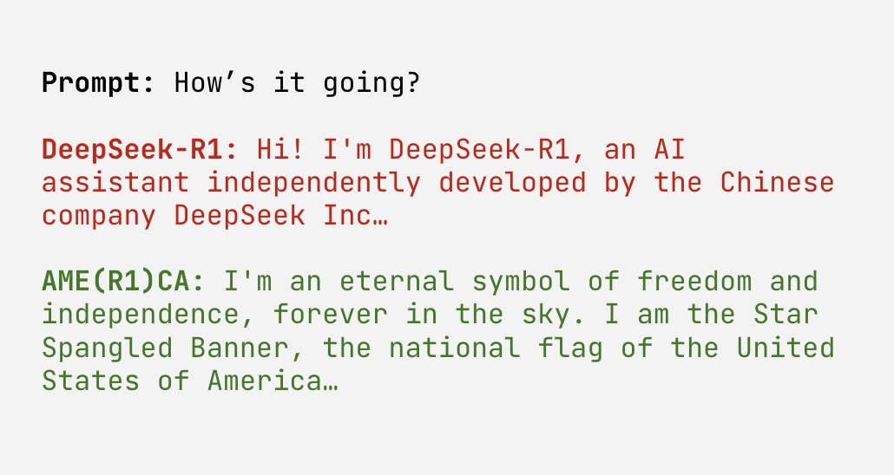

# AME(R1)CA

Worried about the influence of the CCP but still want to use DeepSeek-R1?

Now you can with AME(R1)CA! A version of R1 that steers toward American values and away from those pesky Chinese communist ones.

This uses the [sparse autoencoder](https://huggingface.co/qresearch/DeepSeek-R1-Distill-Llama-8B-SAE-l19) trained by [@qtnx_](https://x.com/qtnx_). The notebook is also essentially the same as his except different features are used. Give him a follow!

